App Name: Productivity

App Tagline: A productivity app for students that incentivizes work

App Description: The app allows users to create accounts where they can keep track
of their classes and assignments. Additionally, they can use the built-in timer
as they work to raise their place in our user work time leader board.

Repo: https://github.com/Trenton-Lyke/ProductivityApp

Demo video: https://youtu.be/lWNudl_Fe6k

Frontend Description:

- Backend integrated user authorization via account creation and logging in 
  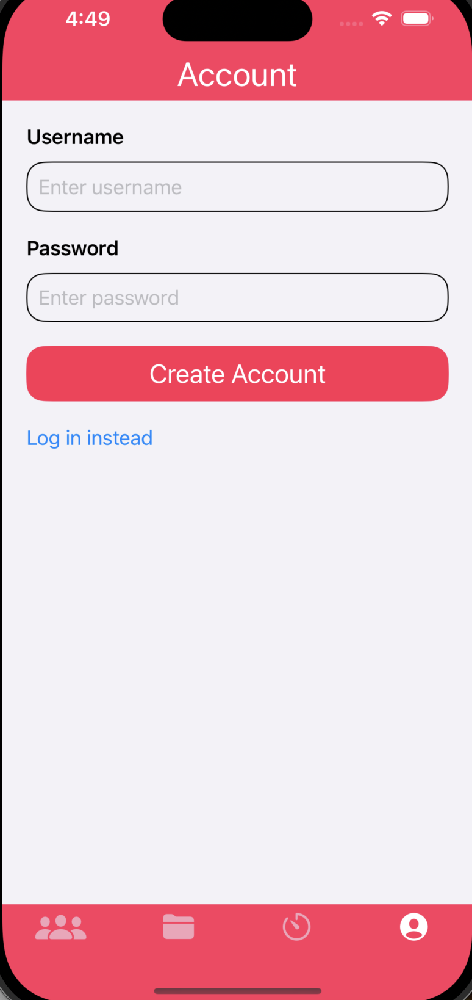
  
- Creating, updating, and deleting an authenticated user's courses on the backend 
  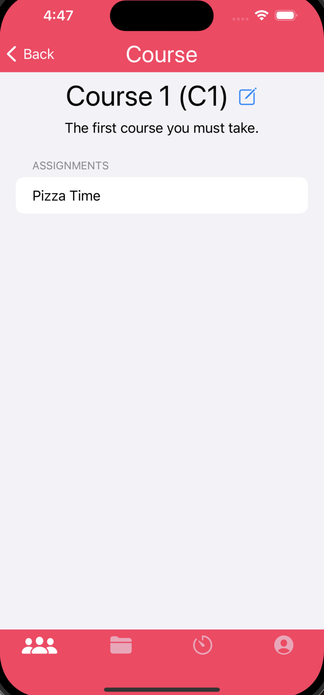
  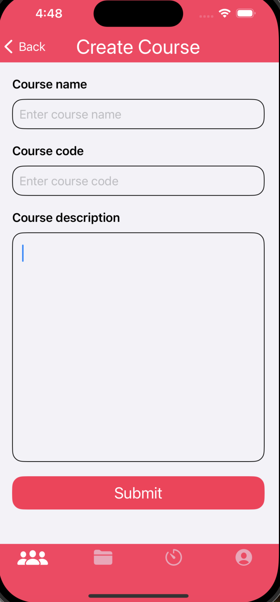
  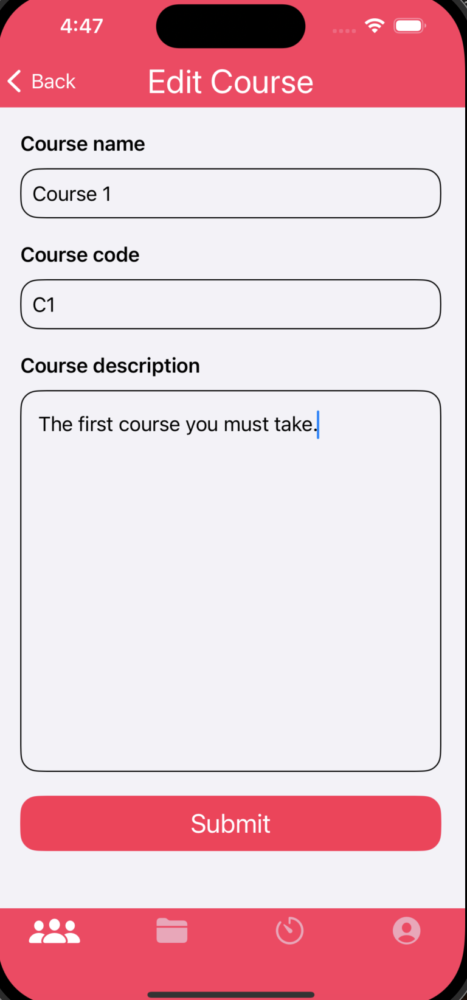
- Displaying authenticated user's courses 
  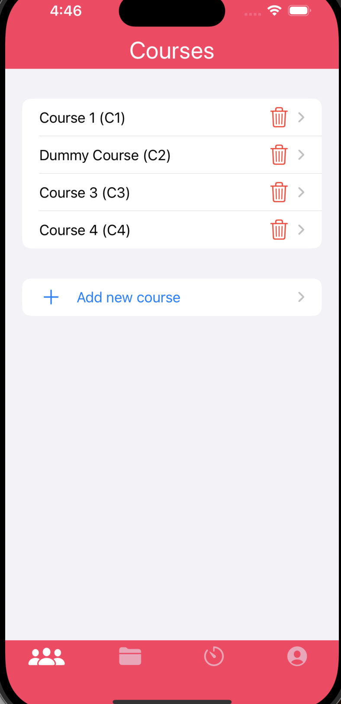
- Creating, updating, and deleting an authenticated user's assignments on the backend 
  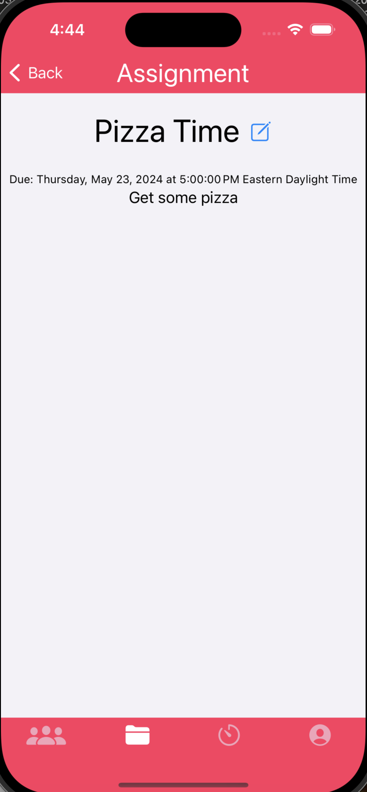
  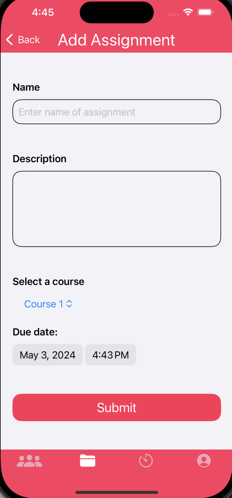
  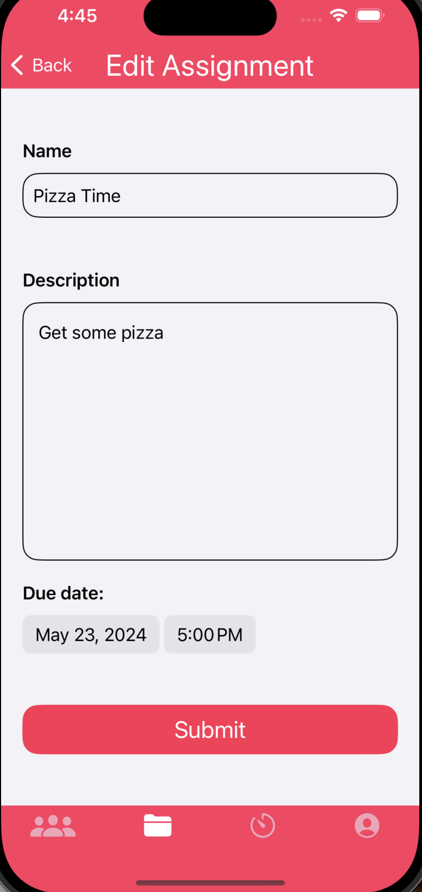
- Displaying authenticated user's assignments and allowing them to check off complete ones 
  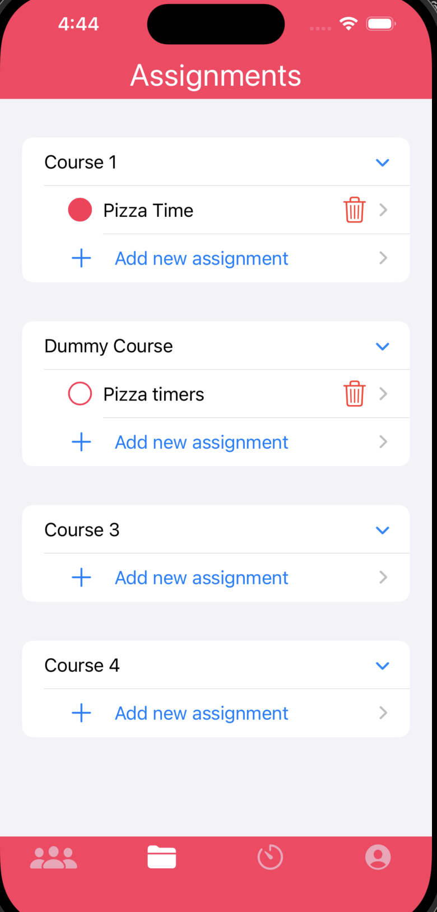
- Allowing authenticated users to set work timers and updating time worked in backend 
  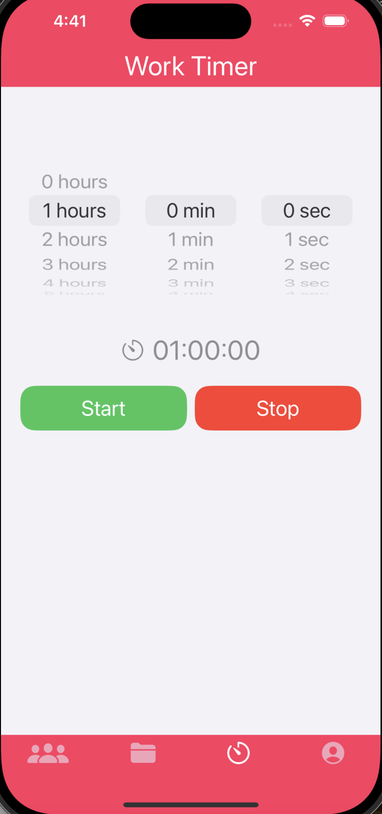
  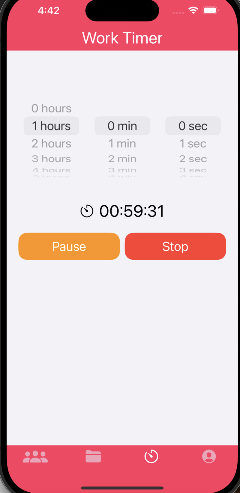
  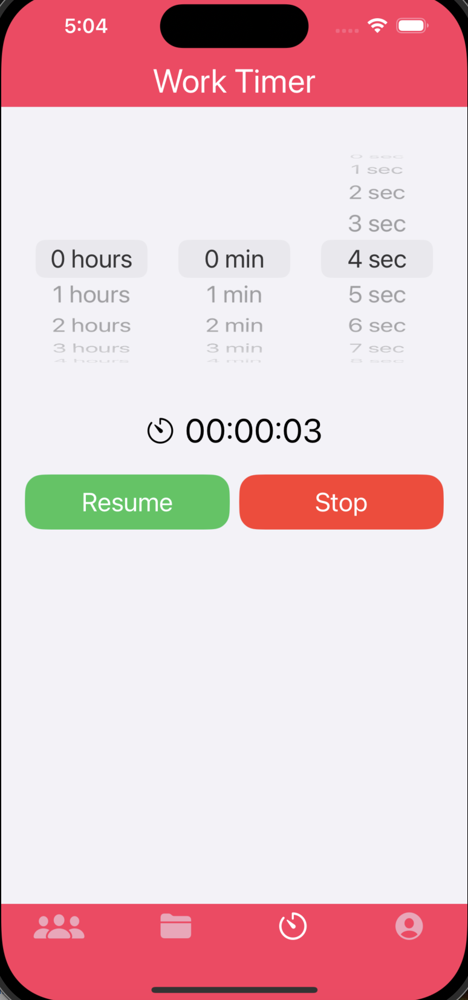
  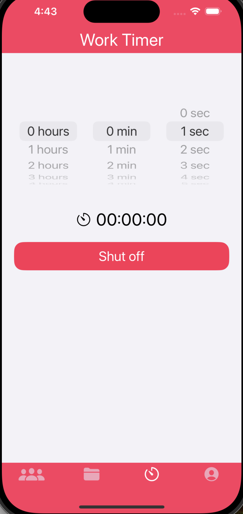
- Displaying status of number of completed assignments and position on time worked leader board 
  

Frontend Requirements:

- Multiple screens that you can navigate between:

  - There multiple sets of screens for each tab of the app that the user can navigate
    through.

- At least one scrollable view:

  - The view for courses and assignments are scrollable.

- Networking integration with a backend API:

  - The app uses the backend API to store, retrieve, and update user data.

Backend Requirements:

- At least 4 routes (1 must be GET, 1 must be POST, 1 must be DELETE):

  - Implemented route for getting user by id: GET /api/users/\<int:user_id>/
  - Implemented route for updating assignment: POST: /api/assignment/\<int:assignment_id>/
  - Implemented route for deleting assignment: DELETE: /api/assignment/\<int:assignment_id>/

- At least 2 tables in database with a relationship between them:

  - We have a User table and a Timer table where there are many timers for one user

- API specification explaining each implemented route:

  - Included in repo
